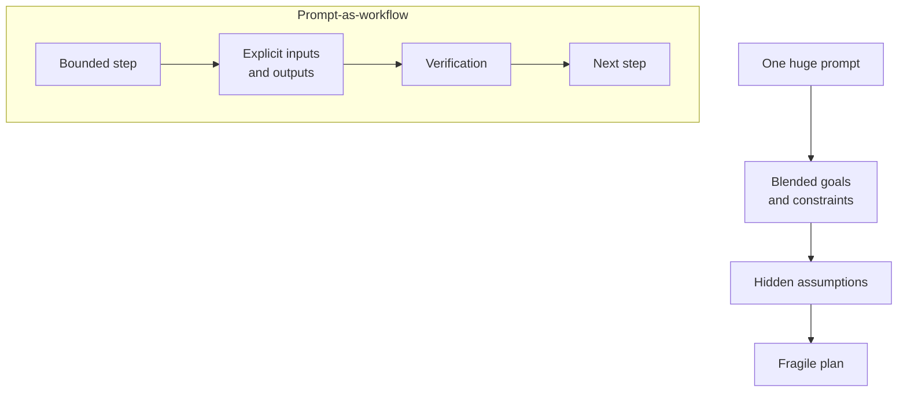
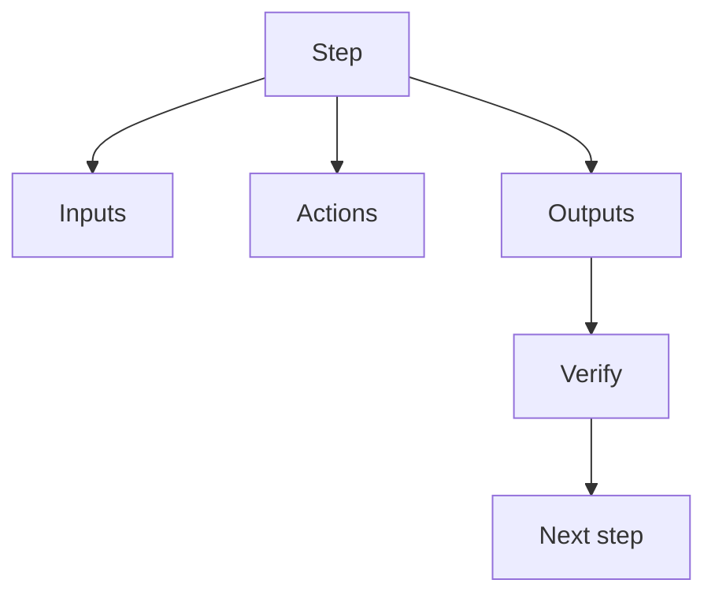
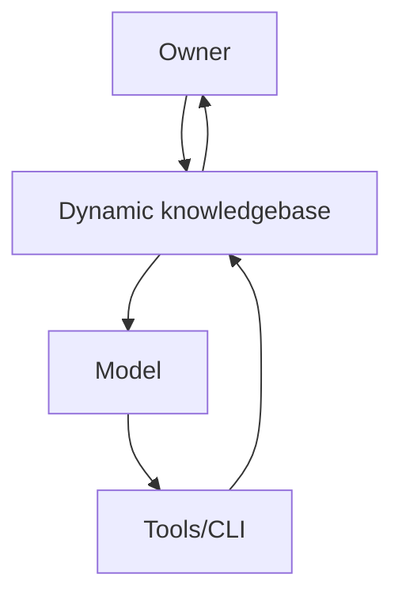

# AI and Complex Problems: A Practical View

AI can be a real multiplier on complex work, but only when it is used in a way that respects uncertainty, hidden constraints, and the cost of verification. The goal here is simple: explain what breaks, why it breaks, and how to build a workflow that keeps you in control.

## Why Complex Problems Break AI
Complex problems are not just big. They are fuzzy, changing, and full of hidden constraints. AI needs clarity, but complexity often starts with uncertainty. When we ask for a one‑shot solution, the model fills the gaps with guesses and we end up with a confident, fragile plan. The failure is rarely obvious in the moment; it shows up later, when the solution hits real systems, real stakeholders, and real constraints.

## What Breaks in Practice
On real projects the same patterns repeat. The most common is prompt overload: we cram everything into one request, which forces the model to blur priorities, mix constraints with implementation details, and guess at missing information. Another frequent break is missing context; critical constraints live in policy, legacy behavior, or team conventions, and if they are not explicit the output quietly violates them.

Then there is weak decomposition. If the first breakdown is wrong, every later step is wrong, and complexity makes errors compound. You also see fluent but shallow output: it reads well, but it lacks concrete inputs, outputs, and verification. Evaluation often stays vague; without acceptance criteria or tests, the output is hard to validate, so it gets accepted too early. Finally, tooling mismatch shows up late, when a plan assumes data access, permissions, or tools that are not actually available.

Mermaid source

## A Better Mental Model
The core issue is not intelligence, it is structure. Complex work needs boundaries, explicit inputs, and verification. The safest mental model is “prompt as workflow,” where each step is constrained and testable, and big steps can become their own sub‑workflows or prompts. This shifts the problem from “generate the answer” to “generate the next bounded step,” which is far more reliable.

Mermaid source

## How to Use It Safely
Use a workflow mindset, even for small tasks. Start by defining the inputs: list the exact files, systems, constraints, and acceptance criteria. Do not let the model infer them. Then decompose the work into bounded steps with explicit inputs, actions, and outputs; if a step grows, split it.

Make your knowledgebase dynamic. Treat the current repo, docs, workflow schemas, configs, and CLI capabilities as the source of truth, not the model’s memory. Pull in the exact files and current rules that define how work should be structured, and refresh them as you go. If the workflow depends on tooling or data access, verify it directly before you plan around it.

Mix prompts with real verification. Use prompts for reasoning, then bind outcomes to checks you can run: tests, linting, diffs, or CLI validation. Finally, validate each step against acceptance criteria before moving on and keep ownership human. A good workflow makes assumptions visible early, and makes failure cheap.

Mermaid source

## Keep Going
This is the foundation. The next step is to turn these ideas into concrete templates: how to draft workflows with explicit inputs/outputs, when to extract child workflows, and how to design acceptance criteria that are cheap, fast, and real.

Diagram sources live in `research/ai/ai-complex/` and are exported to `assets/ai-complex/`.
